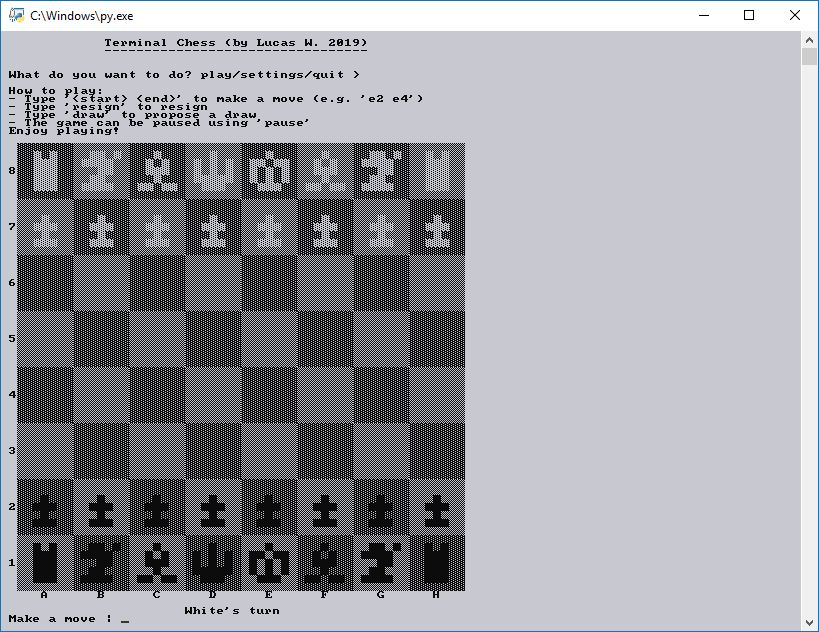

# commandline-chess
Chess for the command line
Updated on the 24 May 2019

To run the script, only Python (including its standard libraries) have to be installed.
The script is run in the command line and will display its chess positions using space and block characters provided in Unicode,
it is this advised to set the command line font to a (rasterized) square font for correct display of sizes of type AxA (e.g. 5x5).
In the case such a font is not available, sizes of type 2*AxA (e.g. 10x5) are available.

Features of this program include:
- Normal Chess with all standard FIDE-rules pre-programmed. (i.e. no legal moves allowed, checkmate and szalemate is detected etc.)
- Size and color palette settings for optimal display of the chessboard. (2x2, 3x3, 6x3, 5x5, 10x5, 7x7, 14x7, 9x9 and light, lighter, contrast, dark, darker)
- Timed games with/without increment possible.
- working Fischerandom/Chess960 boardcomplexi.
- Different dialogue languages available (currently: English and German)

Known Issues include:
- 'En passant' and 'castling' possibility changes are not considered when checking for threefold repetition.
- Castling is currently incompatible with a randomly generated Chess960 board.

This program was orignally made for a school project, where we were free to do anything we would like.
I chose to do Terminal Chess for the fun (being in the school's chess club), the challenge (implementation with few lines but still readable code) and the artistic value (restricted display, pixel art graphics).
Though it is not perfect, the program is open-source and free-to-play.

